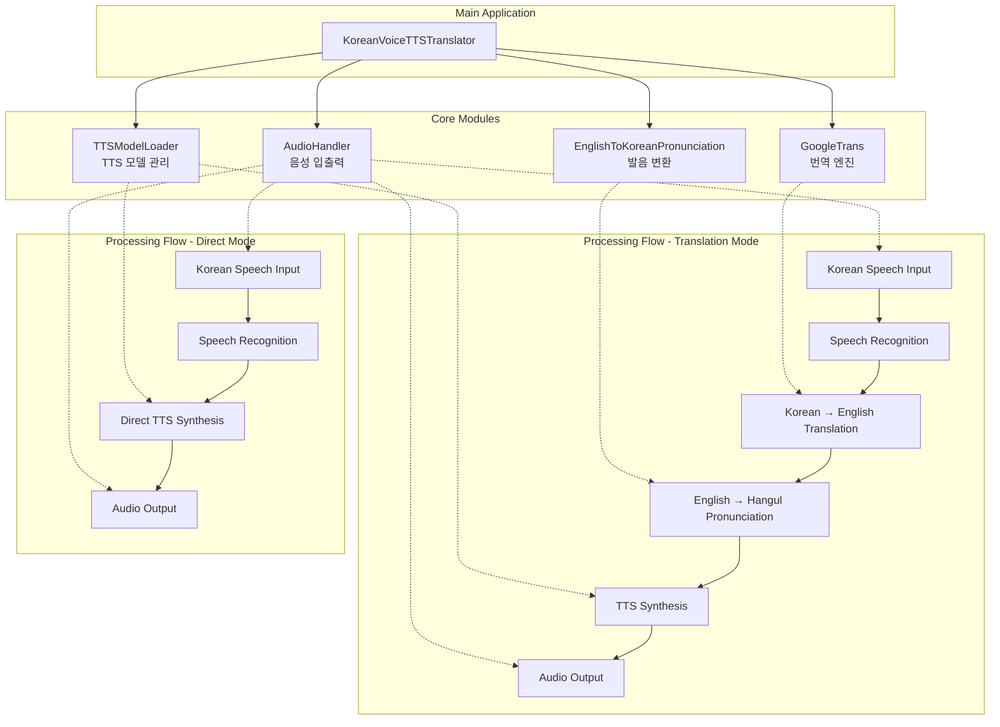

# 🎙️ Custom Voice TTS
> **나만의 목소리로 만드는 실시간 한국어 음성합성 시스템**

<div align="center">


</div>

---

## 📌 Overview

**실시간 음성 입력 및 번역 기능을 갖춘 다목적 한국어 음성 합성 프로젝트**입니다. 
`voice_recorder`를 통해 나만의 목소리를 녹음하고, Glow-TTS와 HiFi-GAN 모델을 직접 훈련하여 자연스러운 커스텀 음성을 생성하는 전체 과정을 지원합니다.

### ✨ Key Features

<div align="center">
<table>
<tr>
<td width="50%">

#### 🎤 **커스텀 목소리 훈련**
- 개인 음성 데이터셋 생성
- Glow-TTS 모델 직접 훈련
- HiFi-GAN 보코더 학습
- 고품질 한국어 TTS 구현

</td>
<td width="50%">

#### 🔄 **실시간 음성 처리**
- 실시간 마이크 음성 입력
- 한국어 → 영어 번역
- 영어 → 한글 발음 변환
- 자연스러운 음성 출력

</td>
</tr>
</table>
</div>

### 🎯 작동 모드

<div align="center">

| 모드 | 설명 | 기능 |
|:---:|:---|:---|
| **직접 모드** | 입력된 한국어 텍스트를 바로 음성으로 합성 | 한국어 → 한국어 음성 |
| **번역 모드** | 한국어를 영어로 번역 후 한글 발음으로 변환하여 음성 합성 | 한국어 → 영어 → 한글발음 → 음성 |

</div>

---

## 🏗️ System Architecture

### 전체 시스템 구조



### 📁 Project Structure

```
custom-voice-tts/
│
├── 📄 main.py                      # Main application entry point
├── 📄 audio_handler.py             # Audio input/output processing
├── 📄 tts_model_loader.py          # TTS model loading and management
├── 📄 pronunciation_converter.py   # English to Korean pronunciation
├── 📋 requirements.txt             # Package dependencies
│
├── 🎙️ voice_recorder/              # Voice data collection tools
│   ├── create_dataset.py           # Dataset creation script
│   ├── prompts.example.csv         # Example recording prompts
│   ├── recording_prompts.csv       # Actual recording prompts
│   ├── requirements.txt            # Recording dependencies
│   └── recordings/                 # Generated voice recordings
│       └── *.wav                   # Individual voice files
│
├── 📊 data/                        # Training data and trained models
│   ├── filelists/                  # Training file lists
│   │   ├── wavs/                   # Training audio files
│   │   ├── metadata.csv            # Audio-text mapping
│   │   └── ljs_audio_text_val_filelist.txt
│   │
│   ├── glowtts-v2/                 # Trained Glow-TTS models
│   │   └── glowtts-v2-[DATE]_[HASH]/
│   │       ├── best_model.pth.tar
│   │       └── config.json
│   │
│   └── hifigan-v2/                 # Trained HiFi-GAN models
│       └── hifigan-v2-[DATE]_[HASH]/
│           ├── best_model.pth.tar
│           └── config.json
│
├── 🤖 TTS/                         # Coqui TTS library (cloned)
│   └── ...                         # SCE-TTS fork
│
├── 🔤 transliteration/             # Korean-English transliteration
│   └── ...                         # muik/transliteration library
│
├── 📈 train_glowtts.py             # Glow-TTS training script
├── 📈 train_hifigan.py             # HiFi-GAN training script
└── 📊 logs/                        # Training logs and outputs
```

---

## 🚀 Quick Start

### Prerequisites

#### System Requirements
- **OS**: Windows 10+, macOS 10.14+, Ubuntu 20.04+
- **Python**: 3.8 이상
- **GPU**: NVIDIA GPU 권장 (모델 훈련용)
- **RAM**: 최소 8GB (16GB 권장)
- **Storage**: 5GB 여유 공간
- **Microphone**: 녹음용 마이크

### Installation

#### 1️⃣ 저장소 복제
```bash
git clone https://github.com/JHC1023/custom-voice-tts-.git
cd custom-voice-tts
```

#### 2️⃣ 의존성 라이브러리 복제
프로젝트 폴더 내에 외부 라이브러리들을 직접 클론합니다:

**Coqui TTS (SCE-TTS Fork):**
```bash
git clone https://github.com/sce-tts/TTS.git
```

**English-Korean Transliteration:**
```bash
git clone https://github.com/muik/transliteration.git
```

#### 3️⃣ 필수 패키지 설치

**메인 애플리케이션:**
```bash
pip install -r requirements.txt
```

**음성 녹음 도구:**
```bash
pip install -r voice_recorder/requirements.txt
```

---

## 💻 나만의 목소리 모델 만들기 및 사용법

이 가이드는 프로젝트를 처음 설정하는 것부터 자신만의 목소리로 음성을 생성하기까지의 전체 과정을 안내합니다.

### 🎤 1단계: 목소리 데이터셋 생성

`voice_recorder` 디렉토리의 스크립트를 사용하여 모델 훈련에 필요한 음성 데이터셋을 만듭니다.

#### 녹음용 문장 준비
```bash
# voice_recorder 폴더의 prompts.example.csv 파일을 recording_prompts.csv로 복사
cp voice_recorder/prompts.example.csv voice_recorder/recording_prompts.csv
```

`recording_prompts.csv` 파일을 열어 직접 녹음하고 싶은 자신만의 문장으로 수정하거나 추가합니다.

#### 녹음 스크립트 실행
```bash
python voice_recorder/create_dataset.py
```

**녹음 과정:**
- 스크립트의 안내에 따라 `recording_prompts.csv`에 있는 문장을 읽고 녹음합니다
- 녹음이 완료되면 `voice_recorder` 폴더 안에 음성 파일(`recordings/`), 학습용 목록 파일(`metadata.csv`, `ljs_audio_text_val_filelist.txt`)이 생성됩니다

### 🤖 2단계: 모델 훈련

이제 생성된 데이터셋으로 Glow-TTS와 HiFi-GAN 모델을 훈련시킵니다.

#### 훈련 데이터 배치
2단계에서 생성된 결과물들을 학습 스크립트가 인식할 수 있도록 `data/filelists/` 폴더로 이동시킵니다:

```bash
# voice_recorder/recordings 폴더의 모든 .wav 파일을 data/filelists/wavs/ 폴더로 복사
cp voice_recorder/recordings/*.wav data/filelists/wavs/

# metadata 파일들 복사
cp voice_recorder/metadata.csv data/filelists/
cp voice_recorder/ljs_audio_text_val_filelist.txt data/filelists/
```

#### 훈련 스크립트 실행
```bash
# Glow-TTS 모델 훈련
python train_glowtts.py

# HiFi-GAN 보코더 훈련  
python train_hifigan.py
```

> ⚠️ **주의**: 모델 훈련은 고사양 GPU가 필요하며, 상당한 시간이 소요될 수 있습니다. Google Colab과 같은 클라우드 환경에서 실행하는 것을 권장합니다.

### 🎙️ 3단계: 최종 애플리케이션 실행

모델 훈련이 완료되면, 최종 결과물을 사용하여 메인 프로그램을 실행할 수 있습니다.

#### 훈련된 모델 배치
3단계의 훈련 과정에서 생성된 최종 모델 폴더(날짜와 해시값 포함)를 `data/` 디렉토리 안으로 복사합니다. 최종적으로 아래와 같은 구조가 되어야 합니다:

```
data/
├── glowtts-v2/
│   └── glowtts-v2-[DATE]_[HASH]/
│       ├── best_model.pth.tar
│       └── config.json
└── hifigan-v2/
    └── hifigan-v2-[DATE]_[HASH]/
        ├── best_model.pth.tar
        └── config.json
```

#### 메인 프로그램 실행
```bash
python main.py
```

프로그램이 시작되면 안내에 따라 **'직접 한국어 모드'** 또는 **'번역 모드'**를 선택하여 자신의 목소리로 생성된 음성을 확인할 수 있습니다.

---

## 🎬 Usage Modes

### 모드 1: 번역 모드 (기본)
1. 프로그램 실행 후 **Enter** 키만 누르기
2. "한국어로 말해주세요"가 나오면 마이크에 대고 한국어로 말하기
3. 시스템이 다음 과정을 자동 처리:
   - 한국어 음성 인식
   - 한국어 → 영어 번역
   - 영어 → 한글 발음 변환 
   - 한글 발음을 사용자의 목소리로 TTS 출력

### 모드 2: 한국어 직접 모드
1. 프로그램 실행 후 **'k'** 입력 후 **Enter**
2. "한국어로 말해주세요"가 나오면 마이크에 대고 한국어로 말하기
3. 입력된 한국어가 바로 사용자의 목소리로 TTS 출력

### 종료 방법
음성으로 다음 중 아무거나 말하면 프로그램이 종료됩니다:
- "quit", "exit", "종료", "끝", "그만"

**예시 - 번역 모드:**
- **입력**: "안녕하세요, 만나서 반갑습니다" (한국어 음성)
- **번역**: "Hello, nice to meet you" (영어)
- **변환**: "헬로우, 나이스 투 밋 유" (한글 발음)
- **출력**: "헬로우, 나이스 투 밋 유" (사용자 목소리로)

**예시 - 직접 모드:**
- **입력**: "오늘 날씨가 정말 좋네요" (한국어 음성)
- **출력**: "오늘 날씨가 정말 좋네요" (사용자 목소리로)

---

## 🔧 Development

### 모델 커스터마이징

**하이퍼파라미터 조정:**
- `train_glowtts.py`에서 학습률, 배치 크기 등 조정
- `train_hifigan.py`에서 보코더 설정 변경

**데이터셋 확장:**
- `recording_prompts.csv`에 더 많은 문장 추가
- 다양한 감정과 억양의 음성 녹음

### 성능 최적화

- **GPU 메모리 최적화**: 배치 크기 조정
- **추론 속도 향상**: 모델 양자화 적용
- **음질 개선**: 더 많은 훈련 데이터 수집

---

## 🐛 Troubleshooting

### 자주 발생하는 문제

<details>
<summary><b>녹음이 되지 않을 때</b></summary>

```python
# 마이크 테스트 코드
import sounddevice as sd
import numpy as np

def test_microphone():
    try:
        duration = 3  # 3초 테스트
        fs = 44100  # 샘플링 주파수
        print("마이크 테스트 시작... 3초간 말해보세요.")
        audio = sd.rec(int(duration * fs), samplerate=fs, channels=1)
        sd.wait()
        print("녹음 완료!")
        return True
    except Exception as e:
        print(f"마이크 오류: {e}")
        return False

test_microphone()
```
</details>

<details>
<summary><b>GPU 메모리 부족 오류</b></summary>

**해결 방법:**
1. 배치 크기 줄이기:
```python
# train_glowtts.py에서
batch_size = 16  # 32에서 16으로 감소
```

2. 그래디언트 체크포인팅 활성화:
```python
# 모델 설정에서
use_gradient_checkpointing = True
```
</details>

<details>
<summary><b>모델 로딩 실패</b></summary>

**체크리스트:**
1. 모델 파일 경로 확인
2. `config.json` 파일 존재 확인
3. PyTorch 버전 호환성 확인:
```bash
pip install torch==1.13.1 torchaudio==0.13.1
```
</details>

<details>
<summary><b>의존성 라이브러리 설치 실패</b></summary>

**해결 방법:**
1. TTS 라이브러리가 제대로 클론되었는지 확인:
```bash
ls TTS/  # TTS 폴더 내용 확인
```

2. transliteration 라이브러리 확인:
```bash
ls transliteration/  # transliteration 폴더 내용 확인
```

3. 가상환경 사용 권장:
```bash
python -m venv venv
source venv/bin/activate  # Linux/Mac
# 또는
venv\Scripts\activate  # Windows
```
</details>

---

## 🤝 Contributing

### 기여 방법

1. **Fork** 저장소
2. **Feature 브랜치** 생성 (`git checkout -b feature/AmazingFeature`)
3. **변경사항 커밋** (`git commit -m 'Add some AmazingFeature'`)
4. **브랜치에 Push** (`git push origin feature/AmazingFeature`)
5. **Pull Request** 생성

### 기여 가이드라인

- 코드 스타일: PEP 8 준수
- 테스트: 새 기능에 대한 테스트 작성
- 문서화: README 및 코드 주석 업데이트

---

## 💬 참고 및 감사의 글 (References & Acknowledgements)

이 프로젝트는 [SCE-TTS 프로젝트](https://sce-tts.github.io/)를 깊이 참고하여 제작되었습니다. 복잡한 라이선스 환경 속에서도 훌륭한 결과물을 오픈소스로 공개해주신 원작자 및 기여자들께 감사드립니다.

---

## 📜 라이선스 (License)

이 프로젝트에서 직접 작성된 코드(`main.py`, `audio_handler.py` 등)는 **MIT 라이선스**에 따라 배포됩니다.

### 의존성 라이선스

단, 이 프로젝트는 여러 오픈소스 구성요소에 의존하고 있으며, 각 구성요소는 자체 라이선스를 따릅니다. 이 프로젝트를 사용하시는 분은 아래의 라이선스들을 모두 준수해야 합니다:

| 구성요소 | 라이선스 |
|:---|:---|
| **Coqui TTS** | `Mozilla Public License 2.0` |
| **g2pK** | `Apache License 2.0` |
| **mimic-recording-studio** | `Apache License 2.0` |
| **한국어 데이터 원본 (AI Hub)** | `CC-BY 2.0` |

전체적인 라이선스에 대한 자세한 정보는 SCE-TTS 프로젝트의 원본 정보를 참고해 주시기 바랍니다.

